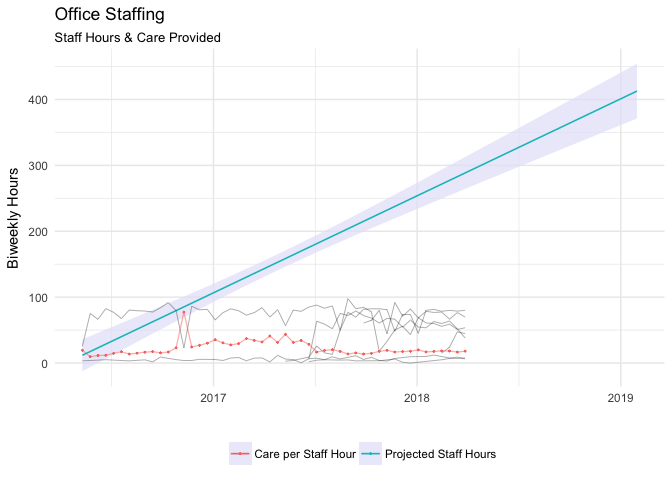

Assignment 1
================
Misha Ash
4/10/2018

## Part 1: Visualization critique

## Part 2: ggplot2 and the grammar of graphics

``` r
# transformed and anonymized data; removed original files
STAFF_PYRL <- read_csv(here::here("data", "STAFF_PYRL.csv"))
```

    ## Parsed with column specification:
    ## cols(
    ##   X1 = col_integer(),
    ##   Date = col_date(format = ""),
    ##   Name = col_character(),
    ##   Hours = col_double()
    ## )

``` r
STAFF_CARE_C <- read_csv(here::here("data", "STAFF_CARE_C.csv"))
```

    ## Parsed with column specification:
    ## cols(
    ##   .default = col_double(),
    ##   X1 = col_integer(),
    ##   Date = col_date(format = ""),
    ##   `<NA>` = col_integer(),
    ##   Name.x = col_character(),
    ##   Name.y = col_character(),
    ##   CYCLE = col_character()
    ## )

    ## See spec(...) for full column specifications.

``` r
ggplot(STAFF_PYRL, aes(Date, Hours)) +

  geom_col(aes(fill = Name), color = "white", size = 0.28) +
  scale_fill_brewer(type = "qual", palette = "Set3", direction = -1) +
  theme_minimal() +
  theme(panel.grid.major.x = element_blank(),
        panel.grid.minor.x = element_blank(),
        legend.title = element_text(""), legend.position = "bottom") +

  geom_point(data = STAFF_CARE_C, 
             aes(y = `CG PER STAFF`, color = "Care per Staff Hour"), size = .25) +
  
  geom_line(data = STAFF_CARE_C, 
              aes(Date, `CG PER STAFF`, color = "Care per Staff Hour"), 
              size = .45, alpha = .5) +
  
  stat_smooth(data = STAFF_CARE_C, 
              aes(Date, `STAFF HOURS`, color = "Projected Staff Hours"), 
              method = lm, fullrange = TRUE, size = .55, alpha = .5, fill = "lavender") +

  labs(x = "", y = "Biweekly Hours", fill="", colour = "",
       title = "Office Staffing",
       subtitle = "Staff Hours & Care Provided")
```

<!-- -->
