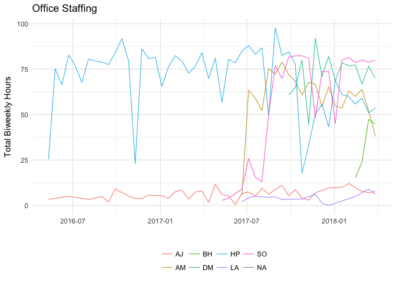

Assignment 1
================
Misha Ash
4/10/2018

## Part 1: Visualization critique

The [Allen Institute for Brain Science](https://www.alleninstitute.org/)
has developed a range of publicly available research tools for
neuroscientists, including a number of brain atlases. Among these is the
[Reference Atlas of the Adult Human Brain](http://atlas.brain-map.org/),
which is one of the most accurate representations of the structure of
the human brain to date. According to [Ding et al.
(2016)](https://www.ncbi.nlm.nih.gov/pmc/articles/PMC5054943/):

> \[It is\] the first digital human brain atlas to incorporate
> neuroimaging, high-resolution histology, and chemoarchitecture across
> a complete adult female brain, consisting of magnetic resonance
> imaging (MRI), diffusion-weighted imaging (DWI), and 1,356
> large-format cellular resolution (1µm/pixel) Nissl and
> immunohistochemistry anatomical plates.

The team of scientists working at the Allen Institute collaborate with
the global neuroscience community to develop and share information
resources for advancing understanding of the brain. Moreover, the images
that constitute the Human Brain Atlas were created through a highly
controlled protocol. One possible limitation of the images might be that
the slices are not equidistant (ranging from 0.4 mm to 3.4 mm), which is
comparable to an axis with unequal units, though this may be relatively
insignificant given the purposes of the images (it is also clearly
stated). Therefore, this interactive visualization is truthful in its
attempt to provide a more accurate, proportionate map of human brain
structures.

The purpose of the this atlas is to inform and drive research, so it is
designed to be useful primarily to scientists. The anatomical structures
are highly detailed and can be individually selected. On the left pane,
a hierarchical outline displays both abbreviations and full names of the
structures, which puts each structure in the context of the structural
organization of the brain: “An essential component of modern interactive
digital atlases is a unifying hierarchical structural ontology that
provides unique IDs (and colors for representation) for each structure
in a parent–child architecture” (Ding et al. 2010). The structure can
thus be selected either by clicking it on the brain section or by name.
The central image is a coronal slice of the left hemisphere, and each
slice (from anterior to posterior) can be seen as a thumbnail along the
bottom. It is entirely not clear why only the left lobe is displayed,
particularly because some brain structures are known to be left or right
lateralized (i.e., not fully symmetrical). A legend shows which slice of
the lateral view is currently selected, which orients the viewer along
the sagittal (front-to-back) axis, but its size varies with zooming
making it difficult to see at some zoom levels. Interactivity also
includes the capacity to zoom and select between alternative coordinate
systems as background images. A legend shows scale (in microns).

Furthermore, many elements can be toggled (description, metadata,
thumbnails, outlines, ontology colors), selection color can be chosen,
and individually configured atlas images can be downloaded. Therefore,
despite its few apparent shortcomings are minor, and the features of
this visualization make it both functional and valuable to researchers
exploring the details of brain anatomy.

The aesthetics of the visualization are appealing and, combined with the
interesting, complex, convoluted structure of the brain, it is
beautiful. Despite the complex data presented, it does not appear
cluttered and irrelevant details are not included. The tool can also be
insightful, and indeed it is designed to foster insight. Highlighting
structures and it is easy to imagine that seeing relations between
structures at high resolution can yield insight into the architecture of
the brain. One limitation of this tool might be the inability to
navigate and explore these structures in three dimensions, however,
which may be more insightful.

Understanding the human brain—often recognized as the most complex piece
of matter in the known universe—is no small feat, and every advance
brings possibilities of developments of new treatments and interventions
closer to the horizon. Advancing understanding of the brain is valuable
and, in light of the prevalence and impact of mental illnesses,
significant. The visualization may therefore also be said to be
enlightening.

## Part 2: ggplot2 and the grammar of graphics

``` r
ggplot(STAFF_PYRL, aes(Date, Hours)) +
  
  stat_smooth(data = STAFF_CARE_C, 
              aes(Date, `STAFF HOURS`, color = "Projected Staff Hours"), 
              method = "gam", fullrange = TRUE, size = .55, alpha = .75, fill = "lavender") +

  geom_line(aes(Date, group=Name), size = 0.28, alpha = .4) +
  #scale_color_brewer(type = "qual", palette = "Set3", direction = -1) +
  theme_minimal() +
  theme(#panel.grid.major.x = element_blank(),
        #panel.grid.minor.x = element_blank(),
        legend.title = element_text(""), legend.position = "bottom") +

  geom_point(data = STAFF_CARE_C, 
             aes(y = `CG PER STAFF`, color = "Care per Staff Hour"), size = .25) +
  
  geom_line(data = STAFF_CARE_C, 
              aes(Date, `CG PER STAFF`, color = "Care per Staff Hour"), 
              size = .45, alpha = .5) +

  labs(x = "", y = "Biweekly Hours", fill="", colour = "",
       title = "Office Staffing",
       subtitle = "Staff Hours & Care Provided")
```

    ## Warning: Removed 22 rows containing non-finite values (stat_smooth).

    ## Warning: Removed 22 rows containing missing values (geom_point).

    ## Warning: Removed 22 rows containing missing values (geom_path).

<!-- -->
